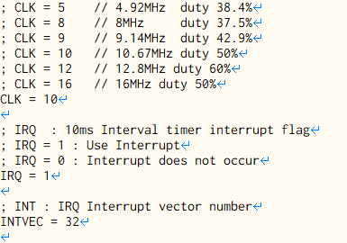
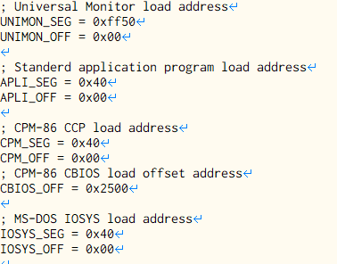
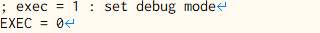

# CPU側のコンフィグレーション

MEZ86.CFGファイルは、ファームウェア起動時に読み込まれ、
CPUのCLK値や、INTRの有無、割込みベクターの値、プログラムを
ロードする情報などの情報を得ます。
 
＜MEZ86.CFGの内容＞ 
 
セミコロン(;)から始まる行はコメント 
 
 
 
CPU側のプログラムを変更する必要があるため、
プログラムのロード情報は変更してはならない。
 
 
 
デバッグモードの設定 
 
 
