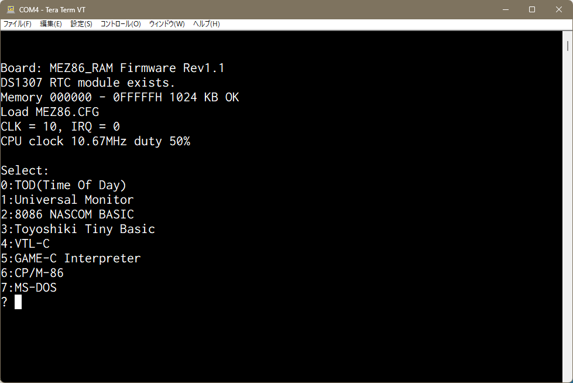

-- Under construction --
# MEZ86_RAM Rev1.1

MEZ86_RAM Rev1.1は[EMUZ80](https://vintagechips.wordpress.com/2022/03/05/emuz80_reference/)ボード上で動く8086/V30メザニンボードです。

（MEZ86_RAM Rev1.1メザニンボード）
 

EMUZ80はMicrochip社のPIC18F47Q43/83/84を使用して、Z80を制御するシングルボードコンピュータ
です。また、Z80の代わりにメザニンボードを装着することで、レガシーCPU（68008や、8086、V30、他）
を動かすことが出来ます。 
UART, SPI, I2C等の制御をPICで行い、レガシーCPUの外部I/Oとして機能を提供します。
SDカードはSPIを通して実装されています。 
PICから、レガシーCPUのメモリ空間にアクセスすることで、レガシーPCのプログラムをロードする
ことが出来るため、ROMは必要なくSRAMでプログラムを動作させることが出来ます。

# 起動画面
MEZ86_RAM Rev1.1を起動すると、初期化終了後に、ソフトの選択待ちになります。

 

