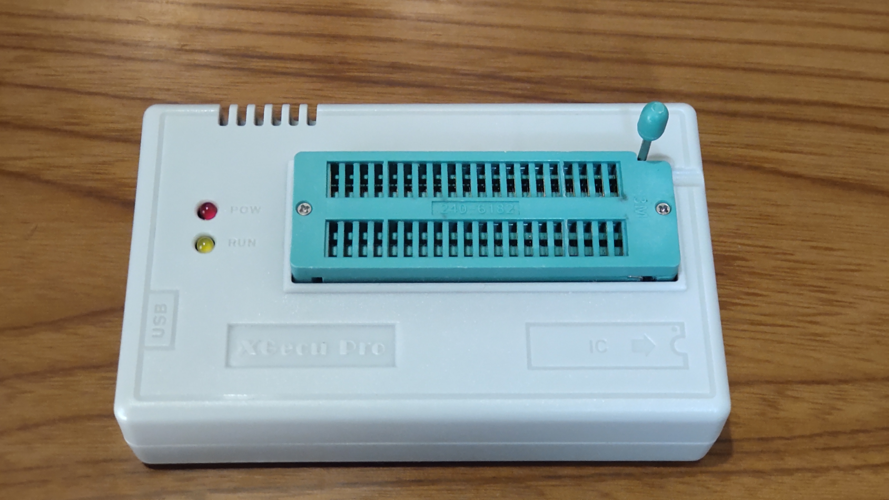

-- Under construction --
# MEZ86_RAM Rev1.1

MEZ86_RAM Rev1.1は[EMUZ80](https://vintagechips.wordpress.com/2022/03/05/emuz80_reference/)ボード上で動く8086/V30メザニンボードです。

（MEZ86_RAM Rev1.1メザニンボード）
 

EMUZ80はMicrochip社のPIC18F47Q43/83/84を使用して、Z80を制御するシングルボードコンピュータ
です。また、Z80の代わりにメザニンボードを装着することで、レガシーCPU（68008や、8086、V30、他）
を動かすことが出来ます。 
UART, SPI, I2C等の制御をPICで行い、レガシーCPUの外部I/Oとして機能を提供します。
SDカードはSPIを通して実装されています。 
PICから、レガシーCPUのメモリ空間にアクセスすることで、レガシーPCのプログラムをロードする
ことが出来るため、ROMは必要なくSRAMでプログラムを動作させることが出来ます。

# １．起動画面
MEZ86_RAM Rev1.1を起動すると、初期化終了後に、プログラムの選択待ちになります。

 

# ２．特徴
・動作CPU : Intel8086 CPU（その他互換CPU) 5MHz/8MHz/10MHz、または、NEC V30(μPD70116) 10MHz/16MHz 
・Microcontroller : PIC18F47Q43, PIC18F47Q84, PIC18F47Q83（注1）（注2） 
・1MB SRAM搭載(AS6C4008-55PCN 2個) 
・μSDカードI/F（SPI) 
・I2C I/F (RTC)リアルタイムクロック：DS1307をサポート）（注3） 
・UART（9600bps無手順） 
・コンソールキー（Ctrl-Qを2回連続入力）によるNMI割込みのサポート（注4） 
・INTRによる10msのインターバルタイマー割込みのサポート（注5） 
・動作プログラム : 後述  
（注1） 
　PIC18F47QXXのCLC機能を使って8086/V30のINTRを実現しています。 
　プログラムでの割込みベクター発生のため、CPU速度10MHzまでの 
　サポートになります。 
　12.8MHz, 16MHzのクロック指定をした場合、INTRが発生しないように 
　ファームウェアで調整されます。 
（注2） 
　PIC18F47QXXから1MBメモリをアクセスするために、8086/V30のALE信号に 
　CPLD(ATF22V10)でゲートロジックを通しています。 
　そのため、V30(μPD70116) 16MHz動作が安定しません。12.8MHzでの動作で 
　安定してると思われます。 
　クロックの設定は、12.8MHz, 16MHzが指定できますが、 
　INTRを使用する場合には10MHz以下に設定する必要があります。 
（注3） 
　I2Cの制御ドライバは、[EMU57Q-8088/V20](https://github.com/akih-san/EMU57Q-Rrv2.1_CPM_MSDOS)のファームウェアを流用しています。 
（注4） 
　NMI割込みで、常駐プログラムのモニター（Universal Monitor）が起動します。 
　モニターのbyeコマンドで、CPU側にリセットをかけてファームウェアの入力待ちに戻ることが出来ます。 
（注5） 
　[コンフィグ設定ファイル](https://github.com/akih-san/MEZ86_RAM/tree/main/DISKS)で割込みベクター番号の設定が可能 

# ３．RTC(DS1307)モジュール
DS1307を使ったTiny RTC moduleをサポートします。 
Tiny RTC moduleはArduinoで使用可能で、amazon, AliExpress等のから入手することができます。 
また、安価な互換品が出回っています。 
テストでは互換品を使いましたが、特に問題なく使用できました。 
SQピン端子は未使用です。SCL、SDA、VCC、GNDの４ピンを使用しています。 
 
日時の設定は、ファームウェア起動時のセレクトリスト0番（TOD）で指定します。 
もしくは、MS-DOSのdate, timeコマンドで設定することが出来ます。 
RTC(DS1307)モジュールが接続されていない場合、PICのtimer0の10msタイマーを用いて、 
日時をカウントします。その場合、電源OFFで日時が2025/06/01 00:00:00にリセットされます。 

(tiny_rtc_modules) 

# ４．μＳＤカードモジュール
SPIで制御されるμＳＤカードモジュールは、Arduinoで使用可能で、amazon, AliExpress等のから入手することができます。 

(μSD Card module) 

# ５．CPLD（22V10）
以下の外部ロジックをCPLD（22V10）を使用して1chipにまとめてあります。 
 
 ・PICからメモリアクセスを行うため、ALE信号の操作 
 ・SDカードアクセスの一部 
 ・バイト、ワードメモリアクセス関連 
 ・CPU HOLD時に、INTR, MIOの信号をPICでA19,A18として使用するための切替回路 
 
動作確認は、ATF22V10C-7PX, GAL22V10B-15LPで行っています。 
使用するために、jedファイルをCPLDに書き込む必要があります。（後述） 

# ６．動作プログラム
提供しているプログラムについては、他のリポジトリのプログラムをMEZ86_RAM上で動作するように移植したものです。 

[SBCV20_8088](https://github.com/akih-san/SBCV20_8088/tree/main) 
 ・Universal Monitor 
 ・Toyoshiki Tiny Basic 
 ・VTL-C 
 ・GAME-C Interpreter 
 
[MEZ88_RAM](https://github.com/akih-san/MEZ88_RAM) 
 ・CP/M-86 
 ・MS-DOS 
 
[8086 NASCOM BASIC](https://github.com/satoshiokue/8086_NASCOM_BASIC) 
 ・8086 NASCOM BASIC 

8086 NASCOM BASICは、[@S_Okue](https://x.com/S_Okue)さん([satoshiokue](https://github.com/satoshiokue))によって
Z80用のアセンブラから、8086用のアセンブラにコンバートされたものです。 
今回、MEZ86_RAM上で動くように移植しました。 
 
Universal Monitorは、単体で起動できますが、他のプログラムを起動したときには、
常駐モニターとしてロードされます。 
プログラム終了時や、（Ctrl+Qキーを2回連続入力で）NMI割込みを発生させると、 
常駐モニターに制御が移ります。モニターのbyeコマンドで、CPUにリセットをかけ 
ファームウェアの選択画面に戻すことができます。 
 

(例：MS-DOSを終了しファームウェアに戻る) 

## INTRによる割込み
提供しているプログラムは、移植のみでINTRによる割込みは使用していません。
INTRの確認は[テストプログラム](https://github.com/akih-san/MEZ86_RAM/blob/main/i86src/standalone/INTR_test)で行っています。

# ７．PIC18F47QXX、CPLDへの書き込み
## 1. PIC18F47QXXへの書き込み
PICへの書き込みツールを用いて、Hexファイルを書き込みます。
INTRによる割込みベクター発生のタイミング調整のため、クロック別にHexファイルがあります。
使用するCPUのクロックに合わせて使用します。 
INTRを使用しない場合には、どのHexファイルを使用しても構いません。ファームウェア起動時に
指定クロック優先でINTRの可不可が調整されます。 
 
- PIC18F47Q43 
　　Q43_5MHz.hex 
　　Q43_8MHz.hex 
　　Q43_9_10MHz.hex 
- PIC18F47Q84
　　Q84_5MHz.hex 
　　Q84_8MHz.hex 
　　Q84_9_10MHz.hex 
- PIC18F47Q83 
　　Q83_5MHz.hex 
　　Q83_8MHz.hex 
　　Q83_9_10MHz.hex 
 
＜使用確認した書き込みツール＞ 
 
- snap(マイクロチップ社の書き込みツール) 

  - [snap](https://www.microchip.com/en-us/development-tool/PG164100)

 
- PICkit3（または互換ツール）  
  PICkitminus書き込みソフトを用いて、書き込むことが出来ます。以下で入手できます。 

  - [PICkitminus](https://github.com/jaka-fi/PICkitminus)

## ２．CPLDへの書き込み

CPLDには、ROMライタを使用してCPLD/MEZ86_RAM.jedファイルを書込みます。
使用したのは、XGecu Programmer Model TL866Ⅱ PLUSです。 
少し古いですが、問題なく書き込みが出来ました。XGecu Official Siteは[こちら](https://xgecu.myshopify.com/) 
ソフトウェアのダウンロードは[こちら](http://www.xgecu.com/en/Download.html?refreshed=1750208080997) 

（今回使用したROMライタ）
 

# ８．μＳＤカードの作成
μSDカードはFAT32を使用しています。4G～16GBまでのＳＤカードで動作確認を行いました。DISKSフォルダ内の以下のフォルダとファイルを、FAT32でフォーマットされた
μSDカードにコピーします。 
 
＜フォルダ＞ 
　・CPMDISKS 
　・DOSDISKS 
 
＜ファイル＞ 
　・BASIC_86.BIN		（8086 NASCOM BASIC） 
　・GMI_S86.BIN			（GAME-86 インタプリタ） 
　・TT_BAS86.BIN		（豊四季タイニーベーシック） 
　・UMON_S86.BIN		（86版ユニバーサルモニタ） 
　・VTL_S86.BIN			（Very Tiny Language） 
　・MEZ86.CFG			（MEZ86_RAM コンフィグファイル） 

# ９．MEZ86_RAM詳細データ
  - [図面](https://github.com/akih-san/MEZ86_RAM/blob/main/pdf/MEZ86_RAM_R1.1%E5%9B%B3%E9%9D%A2.pdf)
  - [部品表](https://github.com/akih-san/MEZ86_RAM/blob/main/pdf/MEZ86_RAM%E9%83%A8%E5%93%81%E8%A1%A8.pdf)
  - [PICピンアサイン](https://github.com/akih-san/MEZ86_RAM/blob/main/pdf/MEZ86_RAM%20R1.1%E3%83%94%E3%83%B3%E3%82%A2%E3%82%B5%E3%82%A4%E3%83%B3.pdf)
  - [Gerberデータ](https://github.com/akih-san/MEZ86_RAM/tree/main/gerber)

## 参考
### EMUZ80 
EUMZ80はZ80CPUとPIC18F47Q43のDIP40ピンIC2つで構成されるシンプルなコンピュータです。 
　　[電脳伝説 - EMUZ80が完成](https://vintagechips.wordpress.com/2022/03/05/emuz80_reference)
### SBCV20 
[SBCV20](https://vintagechips.wordpress.com/category/8088-v20/)
は[電脳伝説](https://vintagechips.wordpress.com/)さんによって作成されたSBCです。 
　　[SBCV20の技術資料](http://www.amy.hi-ho.ne.jp/officetetsu/storage/sbcv20_techdata.pdf) 
　　[SBCV20の入手先](https://store.shopping.yahoo.co.jp/orangepicoshop/pico-a-037.html) 
### SuperMEZ80 
[SuperMEZ80](https://github.com/satoshiokue/SuperMEZ80)は、EMUZ80にSRAMを追加しZ80をノーウェイトで動かすことができます。
### ＠hanyazouさんのソース 
https://github.com/hanyazou/SuperMEZ80/tree/mez80ram-cpm 
### @electrelicさんのユニバーサルモニタ 
https://electrelic.com/electrelic/node/1317 
### オレンジピコショップ 
オレンジピコさんでEMUZ80、その他メザニンボードの購入できます。 
 
https://store.shopping.yahoo.co.jp/orangepicoshop/pico-a-051.html 
https://store.shopping.yahoo.co.jp/orangepicoshop/pico-a-061.html 
https://store.shopping.yahoo.co.jp/orangepicoshop/pico-a-062.html 
https://store.shopping.yahoo.co.jp/orangepicoshop/pico-a-079.html 
https://store.shopping.yahoo.co.jp/orangepicoshop/pico-a-087.html 

