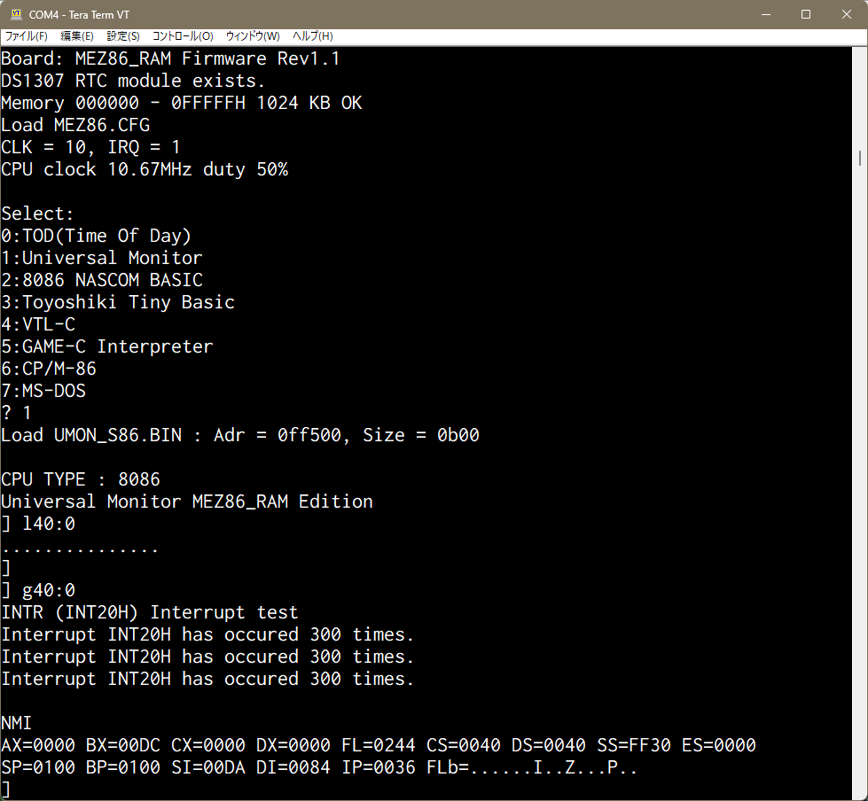

INTRによる10msインターバルタイマー機能の確認方法  

INTRをサポートしているファームウェアを使用します。  

- PIC18F47Q43  
　　Q43_5MHz.hex  
　　Q43_8MHz.hex  
　　Q43_9_10MHz.hex  
- PIC18F47Q84  
　　Q84_5MHz.hex  
　　Q84_8MHz.hex  
　　Q84_9_10MHz.hex  
- PIC18F47Q83  
　　Q83_5MHz.hex  
　　Q83_8MHz.hex  
　　Q83_9_10MHz.hex  

書込んだファームウェアと、MEZ86.CFGで設定するCLKの値が  
合っていない場合、INTRは禁止に調整されるので、注意が必要です。  
 
MEZ86.CFGでCPUのクロックは10MHz以下、IRQ=1となっていることを確認します。 

ファームウェアが起動したら、Universal monitorを起動します。 
モニターのHexファイルロードコマンドで、 
 
L40:0 
 
とし、コンソールからINTR_test.hex（先頭の1行を除く）を流し込みます。 

先頭の1行目は、モニターで認識されず、エラーになります。 
:020000020000FC 
 
2行目から最後の行まで、コンソールから流し込みます。 
Windows版のTeraTermを使用しているなら、Hexファイルをテキストエディタで開いて、 
2行目から最後の行までコピーし、TeraTerm上でペーストすれば流し込むことができます。 
 
読み込みが終わると、コマンドプロンプトがでますので、 
 
G40:0 
 
実行すると、割込み300回ごとに 
 
Interrupt INT20H has occured 300 times. 
 
が表示されます。 
 
停止はCtrl+Qキー2回連続入力でNMIを発生させます。 

(INTR TEST結果) 

